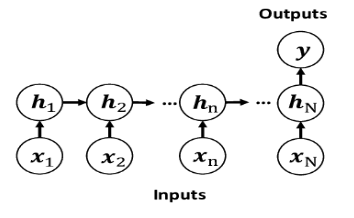

<div id="top"></div>

<!-- TABLE OF CONTENTS -->
<details>
  <summary>Table of Contents</summary>
  <ol>
    <li>
      <a href="#about-the-project">About The Project</a>
      <ul>
        <li><a href="#built-with">Built With</a></li>
      </ul>
    </li>
    <li>
      <a href="#getting-started">Getting Started</a>
      <ul>
        <li><a href="#prerequisites">Prerequisites</a></li>
        <li><a href="#installation">Installation</a></li>
      </ul>
    </li>
    <li><a href="#usage">Usage</a></li>
    <li><a href="#contact">Contact</a></li>
  </ol>
</details>


<!-- ABOUT THE PROJECT -->
## About The Project

RNNs are a type of Neural Networks where the output from the previous step is fed as input to the current step. RNN's are mainly used for Sentiment Analysis, Sequence Labeling, Speech Tagging, etc. There are four commonly used types of RNNs and one of them is Many-to-One.
Many-to-One is used when a single output is required from multiple input units or a sequence of them. It takes a sequence of inputs to predict a fixed output. Sentiment Analysis is a common example of this type of RNN. In order to do this, we need to consider a sentence as a word sequence (Many) and then predict its class label (One). That is the process of Many-to-One model. In the following figure, you can see a standard Many-to-One Architecture:




<p align="right">(<a href="#top">back to top</a>)</p>


### Built With

Libraries which i have used : 

* [Pandas](https://pandas.pydata.org)
* [Numpy](https://numpy.org)
* [Gensim](https://radimrehurek.com/gensim)
* [Sklearn](https://scikit-learn.org)
* [Tensorflow](https://www.tensorflow.org)


<p align="right">(<a href="#top">back to top</a>)</p>


<!-- GETTING STARTED -->
## Getting Started

First we preprocess our data and then apply rnn on them . 

### Prerequisites

install needed packages :
* Pandas
  ```sh
  pip install pandas 
  ```
* Numpy
  ```sh
  pip install numpy
  ```
* Gensim
  ```sh
  pip install gensim
  ```
* Sklearn
  ```sh
  pip install scikit-learn
  ```
* Tensorflow
  ```sh
  pip install tensorflow
  ```

### Installation


   ```sh
   git clone https://github.com/AmirHosienBatouei/Sentiment-Analysis
   ```


<p align="right">(<a href="#top">back to top</a>)</p>


<!-- USAGE EXAMPLES -->
## Usage

Use this network to predict the label of a sentiment


<p align="right">(<a href="#top">back to top</a>)</p>


<!-- CONTACT -->
## Contact

AmirHosien Batouei : amirdkb@gmail.com

Project Link: [https://github.com/AmirHosienBatouei/Sentiment-Analysis](https://github.com/AmirHosienBatouei/Sentiment-Analysis)

<p align="right">(<a href="#top">back to top</a>)</p>


<!-- MARKDOWN LINKS & IMAGES -->
<!-- https://www.markdownguide.org/basic-syntax/#reference-style-links -->
[rnn_png]: rnn.png
